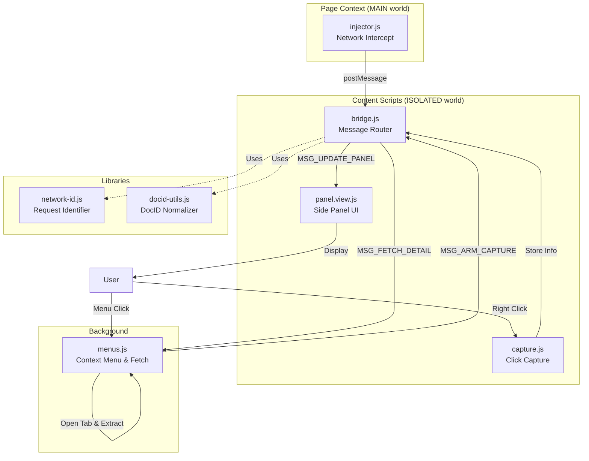

# Chrome Extension 설계 - 국세법령정보시스템 판례 요약 도우미 (완성된 구현 포함)

## 개요 (Overview)

### 모듈 구성
| 모듈명 | 위치 | 책임 |
|--------|------|------|
| Background Service | `/background/menus.js` | 컨텍스트 메뉴 관리, 판례 상세 fetch |
| Main-world Injector | `/content/injector.js` | 네트워크 인터셉트, 판례 목록 추출 |
| Message Bridge | `/content/bridge.js` | 메시지 라우팅, 상태 관리 |
| Click Capture | `/content/capture.js` | 우클릭 이벤트 캡처, 위치 정보 수집 |
| Panel View | `/content/panel.view.js` | 사이드 패널 UI 렌더링 |
| Network Identifier | `/lib/network-id.js` | 네트워크 요청 판별 로직 |
| DocID Utils | `/lib/docid-utils.js` | doc_id 정규화 유틸리티 |

## Architecture Diagram



## Implementation Plan

### 1. Business Logic Modules

#### `/lib/network-id.js` - 네트워크 요청 식별
```javascript
// 핵심 기능: 판례 목록 API 요청 판별
isPrecedentListRequest(url, method, body) {
  // URL 패턴 체크: action.do, ASIPDI002PR01
  // Body 파싱: collectionName, dcmClCdCtl 확인
  // 스코어링: dcm 존재(+5), DOC_ID 유효(+5) 등
}

// 응답에서 판례 목록 추출
extractPrecedentList(responseData) {
  // 다양한 응답 구조 처리
  // data.ASIPDI002PR01.body
  // 각 항목에서 DOC_ID, NTST_DCM_DSCM_CNTN 추출
}
```

**Unit Tests:**
- 정상 API 응답 파싱
- 중첩된 dcm 구조 처리
- 누락된 필드 처리
- 빈 응답 처리

#### `/lib/docid-utils.js` - DocID 정규화
```javascript
// 12자리 숫자로 정규화
normalize(docId) {
  // 숫자만 추출
  // 12자리 패딩/트리밍
}

// 판례번호 정규화
normalizeCaseNumber(caseNumber) {
  // 조심-2025-중-2139 형식 처리
  // 전각/반각 변환
}
```

**Unit Tests:**
- 다양한 docId 형식 정규화
- 판례번호 매칭 정확도
- Edge cases (null, undefined, 특수문자)

### 2. Background Module

#### `/background/menus.js` - 백그라운드 서비스
```javascript
// 🔥 핵심 개선: 새 탭 방식으로 판례 상세 가져오기
async function fetchPrecedentDetailViaTab(docId) {
  // 1. 백그라운드 탭 열기
  chrome.tabs.create({ url: detailUrl, active: false })
  
  // 2. 페이지 완전 로딩 대기 (status === 'complete')
  // 3. 추가 3초 대기 (동적 렌더링)
  // 4. 스크립트 주입으로 DOM 추출
  chrome.scripting.executeScript({
    target: { tabId },
    func: extractContentFromPage
  })
  
  // 5. 탭 자동 닫기
  // 6. 결과 반환
}

// DOM에서 콘텐츠 추출 (주입 스크립트)
function extractContentFromPage() {
  // 방법 1: [data-center-type="body_content_htmlCntn"]
  // 방법 2: .word_group (3번째 요소)
  // 방법 3: .bo_body_cont.vertical_scroll
  // 방법 4: 키워드 기반 body 텍스트 추출
  const keywords = ['사실관계', '이유', '판단', '사건'];
  // 키워드 이후 100줄 추출
}
```

**필수 권한 (manifest.json):**
```json
{
  "permissions": ["contextMenus", "activeTab", "scripting", "tabs"],
  "host_permissions": ["https://taxlaw.nts.go.kr/*"]
}
```

### 3. Content Script Modules

#### `/content/injector.js` - Main-world 스크립트 (CSP 우회)
```javascript
// 🔥 "world": "MAIN" 설정으로 페이지 컨텍스트에서 실행
(function() {
  // fetch 패치
  const originalFetch = window.fetch;
  window.fetch = async function(...args) {
    const response = await originalFetch(...args);
    
    if (args[0].includes('action.do')) {
      response.clone().text().then(text => {
        const jsonObj = JSON.parse(text);
        // ASIPDI002PR01.body에서 판례 목록 추출
        if (jsonObj.data?.ASIPDI002PR01?.body) {
          const precedentList = normalizePrecedentData(jsonObj.data.ASIPDI002PR01.body);
          
          // Content script로 전달 (postMessage)
          window.postMessage({
            type: 'MSG_PRECEDENT_LIST_SAVED',
            data: { list: precedentList }
          }, window.location.origin);
        }
      });
    }
    return response;
  };
  
  // XMLHttpRequest 패치 (동일 로직)
})();
```

#### `/content/bridge.js` - 메시지 라우팅
```javascript
// 저장된 판례 목록
let savedPrecedentList = [];

// Main-world에서 메시지 수신
window.addEventListener('message', (event) => {
  if (event.data.type === 'MSG_PRECEDENT_LIST_SAVED') {
    savedPrecedentList = event.data.list;
  }
});

// Background에서 ARM 신호 수신
chrome.runtime.onMessage.addListener((request) => {
  if (request.type === 'MSG_ARM_CAPTURE') {
    const clickedInfo = window.__lastClickedPrecedentInfo;
    
    // rowIndex 매칭 (최우선)
    if (clickedInfo?.rowIndex >= 0) {
      const matchedItem = savedPrecedentList[clickedInfo.rowIndex];
      const docId = matchedItem?.docId;
      
      // Background로 상세 요청
      chrome.runtime.sendMessage({
        type: 'MSG_FETCH_DETAIL',
        docId: docId
      }, (response) => {
        // 패널 업데이트
        window.postMessage({
          type: 'MSG_UPDATE_PANEL',
          data: response
        }, window.location.origin);
      });
    }
  }
});
```

#### `/content/capture.js` - 우클릭 캡처
```javascript
document.addEventListener('contextmenu', function(event) {
  const closestLI = event.target.closest('#bdltCtl > li');
  if (closestLI) {
    const allLIs = Array.from(document.getElementById('bdltCtl').children);
    
    window.__lastClickedPrecedentInfo = {
      rowIndex: allLIs.indexOf(closestLI), // 🔥 핵심: 인덱스 매칭
      caseNumber: closestLI.querySelector('strong')?.textContent,
      timestamp: Date.now()
    };
  }
}, true);
```

### 4. Presentation Module

#### `/content/panel.view.js` - 사이드 패널 UI

**기능:**
- 슬라이드 인/아웃 애니메이션
- doc_id 표시 및 복사 기능
- 판례 상세 콘텐츠 표시
- 로딩/에러 상태 처리

**QA 시트:**

| 테스트 케이스 | 기대 결과 | 검증 방법 |
|--------------|----------|-----------|
| 목록에서 우클릭 → 요약하기 | 패널 열림, doc_id 표시 | rowIndex 매칭 확인 |
| 판례 상세 로딩 | 3-5초 내 콘텐츠 표시 | 새 탭 방식 동작 확인 |
| 패널 닫기 버튼 | 패널 슬라이드 아웃 | 애니메이션 완료 확인 |
| doc_id 복사 | 클립보드 복사 성공 | navigator.clipboard 확인 |
| 연속 클릭 | 이전 패널 닫고 새 패널 | 중복 방지 확인 |
| 네트워크 오류 | 에러 메시지 표시 | 폴백 동작 확인 |

## 핵심 해결 방법

### 1. CSP 우회 ("world": "MAIN")
```json
{
  "content_scripts": [
    {
      "matches": ["https://taxlaw.nts.go.kr/*"],
      "js": ["content/injector.js"],
      "run_at": "document_start",
      "world": "MAIN"  // 🔥 페이지 컨텍스트에 직접 주입
    }
  ]
}
```

### 2. 동적 렌더링 대응 (새 탭 방식)
- Background에서 새 탭 열기 (CORS 제한 없음)
- 페이지 완전 로딩 + 3초 추가 대기
- chrome.scripting.executeScript로 DOM 추출
- 탭 자동 닫기

### 3. rowIndex 기반 정확한 매칭
- 우클릭한 `<li>` 요소의 인덱스 저장
- API 응답 배열과 1:1 매칭
- 판례번호 파싱 불필요

### 4. 다단계 콘텐츠 추출 전략
1. 특정 data-center-type 속성
2. word_group 클래스 (3번째)
3. bo_body_cont 내부 탐색
4. 키워드 기반 텍스트 추출 (폴백)

## 데이터 흐름

```
1. 페이지 로드 → injector.js가 fetch/XHR 패치
2. API 응답 → 판례 목록 50개 추출 → postMessage
3. 우클릭 → capture.js가 rowIndex 저장
4. 메뉴 클릭 → background가 ARM 신호
5. bridge.js가 rowIndex로 doc_id 찾기
6. Background가 새 탭으로 상세 페이지 열기
7. 3초 대기 후 DOM 추출
8. panel.view.js가 콘텐츠 표시
```

## 메시지 타입 정의

| 메시지 타입 | 방향 | 설명 |
|------------|------|------|
| MSG_ARM_CAPTURE | Background → Content | 우클릭 캡처 활성화 |
| MSG_PRECEDENT_LIST_SAVED | Injector → Bridge | 판례 목록 전달 |
| MSG_FETCH_DETAIL | Bridge → Background | 상세 내용 요청 |
| MSG_OPEN_PANEL | Bridge → Panel | 패널 열기 |
| MSG_UPDATE_PANEL | Bridge → Panel | 패널 내용 업데이트 |

## 성능 최적화
- 5초 타임윈도우로 노이즈 차단
- 백그라운드 탭 사용 (사용자 방해 없음)
- 30초 타임아웃으로 무한 대기 방지
- 중복 doc_id 방지

## 에러 처리
- Chrome runtime 에러 체크
- 탭 이미 닫힘 에러 처리
- fetch 실패 시 폴백
- 콘텐츠 미추출 시 body 텍스트 사용

## 테스트 시나리오

### Business Logic 단위 테스트
```javascript
// network-id.js 테스트
describe('isPrecedentListRequest', () => {
  it('should identify precedent list API', () => {
    const result = isPrecedentListRequest('action.do', 'POST', 'ASIPDI002PR01');
    expect(result).toBe(true);
  });
});

// docid-utils.js 테스트
describe('normalize', () => {
  it('should normalize doc_id to 12 digits', () => {
    expect(normalize('14058')).toBe('000000014058');
    expect(normalize('200000000000014058')).toBe('200000000000');
  });
});
```

### 통합 테스트 체크리스트
- [ ] 판례 목록 페이지 로드 시 네트워크 인터셉트 확인
- [ ] 우클릭 시 rowIndex 정확히 캡처
- [ ] 메뉴 클릭 시 doc_id 매칭 성공
- [ ] 새 탭에서 판례 상세 추출 성공
- [ ] 사이드 패널에 콘텐츠 표시
- [ ] 에러 상황 처리 (네트워크 실패, 타임아웃)

## 디버깅 도구
```javascript
// 콘솔에서 실행 가능한 헬퍼 함수
window.__debugGetPrecedentInfo(0);  // 첫 번째 항목 정보
window.__precedentListData;          // 저장된 판례 목록
window.__lastClickedPrecedentInfo;   // 마지막 클릭 정보
window.__debugOpenPanel('123456');   // 수동으로 패널 열기
```

## 설치 및 실행

1. Chrome 브라우저에서 `chrome://extensions/` 접속
2. 개발자 모드 활성화
3. "압축해제된 확장 프로그램 로드" 클릭
4. 프로젝트 폴더 선택
5. 국세법령정보시스템 접속 후 테스트

## 주의사항

- Chrome 111+ 버전 필요 ("world": "MAIN" 지원)
- 백그라운드 탭 권한 필요 (tabs, scripting)
- CSP 우회는 보안 고려사항 확인 필요
- 30초 타임아웃 조정 가능

## 향후 개선 사항

1. **요약 기능 추가**
   - OpenAI API 연동
   - 판례 내용 자동 요약

2. **캐싱 기능**
   - IndexedDB 활용
   - 중복 요청 방지

3. **UI 개선**
   - 다크 모드 지원
   - 폰트 크기 조절
   - 검색 기능

4. **성능 최적화**
   - Virtual scrolling
   - Lazy loading
   - Web Worker 활용